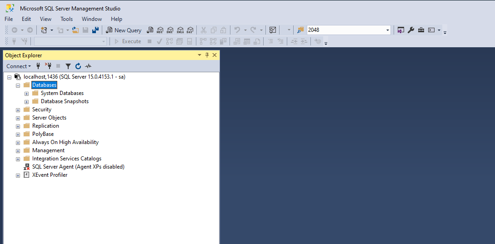
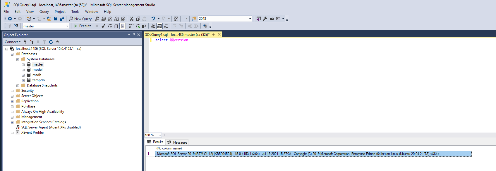

# WSL2 en Docker

## Inleiding

### WSL 2

Als je een ontwikkelaar of systeembeheerder bent die binaire Linux-bestanden moet compileren of Linux-tools moet gebruiken, dan is het Windows Subsysteem voor Linux (WSL) voor jou. WSL maakt het vooral voor ontwikkelaars gemakkelijker om met Linux te werken onder Windows. WSL is een compatibiliteitslaag van Microsoft waarmee Linux-programma’s onder Windows gedraaid kunnen worden. WSL 2 draait een volledige Linux kernel in een lichtgewicht virtuele machine onder Hyper-V. Gebruikers kunnen een Linux distributie laden vanuit de Microsoft Store en deze als een applicatie op hun pc gebruiken. Windows 10 ondersteunt de installatie van meer Linux distributies zij-aan-zij. Omdat WSL 2 niet langer emulatie gebruikt om Linux systeemaanroepen te vertalen, is het volledig compatibel. Je kan bijvoorbeeld Docker voor Linux uitvoeren. 

### Docker

Docker is een computerprogramma om het bestandssysteem van de computer te virtualiseren.

Docker wordt gebruikt om softwarepakketten uit te voeren die 'containers' worden genoemd. Containers zijn geïsoleerd van elkaar door middel van containervirtualisatie, en bundelen hun eigen applicaties, tools, bibliotheken en configuratiebestanden; ze kunnen met elkaar communiceren via goed gedefinieerde kanalen. Alle containers worden uitgevoerd door een enkele kernel van het besturingssysteem en zijn dus lichter dan virtuele machines. Containers worden gemaakt van 'images' die hun precieze inhoud specificeren. Images worden vaak gemaakt door standaard images te combineren en te wijzigen die zijn gedownload van openbare archieven.

## Een nieuwe installatie via PowerShell "Run as administrator"

```powershell
wsl --install -d Ubuntu
```

## Update van een bestaande installatie:

```powershell
wsl --update
```

Herstart bij een update WSL (opgelet, wsl herstarten betekent docker stoppen):

```powershell
wsl --shutdown
```

## Introductie

Vraag je je als DBA wel eens af of er een manier is om verschillende SQL Server versies/edities en op verschillende OS te testen zonder langdurige voorbereidingen en installaties? Die is er: Docker biedt een gemakkelijke manier.

Dit artikel beschrijft hoe je docker-containers op Windows 10 kan uitvoeren voor SQL Server 2019 op Linux. Het behandelt ook hoe je een gegevensdirectory kunt delen met de host voor databases en hoe u SQL Server Agent op containers kunt starten. Microsoft trok de ondersteuning voor SQL Server op Windows onder docker terug.

## Docker installeren op Windows 10

Download Docker Desktop voor Windows van https://www.docker.com/docker-windows. Volg gewoon de instructies om de software te installeren. Eenmaal voltooid zouden we op de taakbalk het docker pictogram moeten zien (het kan in het verborgen pictogrammenvak staan).


Na het starten van Docker Desktop kan je bepalen hoe en wanneer Docker Desktop voortaan actief is op je systeem:


Docker draait standaard in Linux container modus. Als je een Windows container wilt draaien, schakel dan over naar Windows containers modus door rechts te klikken op het docker icoon; dit is echter niet nodig voor SQLServer 2019.


Klik op het docker icoon, en het docker venster verschijnt. We kunnen de huidige beschikbare images, draaiende containers, enz. controleren. Ook kunnen we het gebruiken om containers te starten/stoppen/verwijderen, enz. We zullen de docker GUI niet behandelen. In dit artikel zullen we voornamelijk commandoregels gebruiken om containers te besturen.

## Voor Linux containers

Docker desktop draait standaard in Linux-containermodus.

### Download SQL Server Linux images

Open een cmd venster, voer het volgende uit om de SQL Server 2019 image te downloaden van Microsoft docker hub.

```plain
docker pull mcr.microsoft.com/mssql/server:2019-latest
```

### Draai de docker image voor SQL Server 2019

Laten we poort 1436 mappen op de host voor SQL Server 2019. We zullen ook enterprise editie specificeren met de "MSSQL_PID=Enterprise" optie. Zonder deze instelling draait een container standaard developer edition.

Een paar caveats. Ten eerste, zorg ervoor dat u een complex wachtwoord instelt, anders zult u later niet in staat zijn om verbinding te maken omdat de container niet zal starten. Ten tweede, zorg ervoor dat je dubbele aanhalingstekens ("") gebruikt voor parameters, vooral voor SA_PASSWORD. Ik heb gemerkt, voor Linux, dat de container binnen enkele seconden afbreekt als ik enkel aanhalingsteken ('') of geen aanhalingstekens gebruik.

Hier is het commando om een container te starten en vervolgens de connectie te testen (je kan bijvoorbeeld "exit" intikken bij de prompt). Let op: je geeft hier best een eigen paswoord op in plaats van 1Secure*Password1:

```plain
docker run --name sql_2019_1436 -e "ACCEPT_EULA=Y" -e "SA_PASSWORD=1Secure*Password1" -e "MSSQL_PID=Enterprise" -p 1436:1433 -d mcr.microsoft.com/mssql/server:2019-latest
docker exec -it sql_2019_1436 /opt/mssql-tools/bin/sqlcmd -S localhost -U sa
```


Als dit is uitgevoerd, kunnen we "docker ps -a" uitvoeren om een lijst van containers te zien. We kunnen zien dat zowel sql_2017 als sql_2019_1436 draaien.

## Verbinding maken met SQL Server instance via SSMS

Let op: 

* bij "Server name:" geven we op: "localhost,1436" omdat onze speciale SQLServer communiceert over TCP/IP poort 1436 en niet de standaard SQLServer poort 1433.
* We activeerden niet de geïntegreerde Windows authenticatie, wat wel aangeraden is wanneer je SQLServer rechtstreeks onder Windows installeert en draait, maar de "SQL Server Authentication", dit wil zeggen de "sa" gebruiker met een specifiek paswoord.
* Wanneer je geen toegang krijgt tot je SQLServer, dan betekent dit waarschijnlijk dat je je firewall nog moet configureren en toelaten dat je communiceert met poort 1433. Hoe dit precies moet, hangt af van je firewall programma (betreft het McAfee of de standaard Windows firewall).




Laten we de SQL Server versie controleren:



De docker container stoppen en verwijderen kan via volgende commandolijn-opdrachten:

```plain
docker stop sql_2019_1436
docker rm sql_2019_1436
```

# Installeer MySQL server onder WSL2

Om dit te laten werken, moet Windows 10 versie 1903 zijn bij gebruik van een Intel x64-processor of versie 2004 bij gebruik van een ARM64-processor. Om dit te controleren, klikt u op *Instellingen*: *Over*.

```
docker pull mysql
```

Met MySQL standaard poort:

```
docker run --name ms -p 3306:3306 -e MYSQL_ROOT_PASSWORD=password mysql
```

Installeer workbench onder Windows 10

https://dev.mysql.com/downloads/workbench/


"Other downloads", "No thanks", installeer.

Indien er nog geen "local" instantie herkend wordt, maak er een aan: klik op "+" en geef de connectie een naam. Druk op "test" knop en geef je paswoord in. Bewaar de nieuwe connectieinformatie.

Gebruik Docker Desktop om SQLServer en MySQL te starten.

## Windows Firewall

De Windows Firewall laat je toe om inkomend en uitgaand netwerkverkeer voor een bepaalde applicatie of TCP/IP poort te verbieden of juist toe te laten. Standaard is toegang vaak verboden wanneer de firewall actief is. Je kan met andere woorden heel eenvoudig testen of het je firewall is die toegang verhindert door deze even te desactiveren en opnieuw te testen; dit is echter niet aangeraden omdat dit de kans op inbraak verhoogt.

De Windows Firewall kan op je PC geconfigureerd worden of, indien je computer deel uitmaakt van een Windows domein, dan kan de administrator settings en regels bepalen. In grote organisaties kan het zijn dat port filtering geactiveerd wordt op een netwerk router of switch. 

### Hoe een poort blokkeren of openen met Windows 10/8/7 Firewall

**1. Open Windows Firewall: Advanced Settings.** 

Om je Windows Firewall te openen, geef je ‘firewall.cpl’ in  bij de zoekbalk (search bar) en druk je op de Enter toets. Klik op de **Advanced Settings** link aan de linkerkant van de dialog box. Dit brengt het ‘Windows Firewall with Advanced Security’ venster te voorschijn.


**2. Open Inbound Rules.**

Klik links op ‘**Inbound Rules**‘:


**3. Een nieuwe regel opzetten.**

Kies aan de rechterkant voor ‘**New Rule**…’:


**4. Open de New Inbound Rule Wizard.**

Selecteer ‘**Port**‘ en klik ‘**Next**.’ dit opent het ‘**New Inbound Rule Wizard**’ venster.

Selecteer ‘**Port**’ als nieuw **Rule Type** en klik ‘**Next**.’

Klik op ‘**Specific local ports**.’ Kies een poortnummer (bijvoorbeeld 1436).

Klik op ‘**Next**‘ om door te gaan.


**5. Blokkeer de connectie.**

Selecteer in het Action window ‘**Block the connection**’ en klik ‘**Next**.’

**6. Pas je nieuwe regel toe op elk Profile Type.**

Klik in het Profile window de boxes aan waarop je regel effect heeft: Domain, Private, en Public. Klik op ‘**Next**‘ om door te gaan.

**7. Geef je regel een naam en configureer settings.**

Kies een naam voor je nieuwe regel, bijvoorbeeld ‘**block suspicious ports**.’

Als je klaar bent, klik dan op ‘**Finish**‘ om te bewaren.


### Hoe open je een poort in de Windows Firewall?

Het kan best zijn dat je een poort in de firewall wenst te openen om toegang te geven tot een bepaalde dienst. Dewe procedure verloopt min of meer op dezelfde manier als hierboven. Volg de instructies voor "New Inbound Rule", kies "Port" en selecteer "Allow the connection".

# Informatief - Linux GUI apps (binnenkort)

- Windows 10 Insider Preview build 21362+
- Driver voor vGPU, bijvoorbeeld https://developer.nvidia.com/cuda/wsl.

## Update je packages in je distributie (installeert gnome desktop)

```sh
sudo apt update
sudo apt upgrade
sudo apt install gedit -y
sudo apt install gimp -y
sudo apt install nautilus -y
sudo apt install vlc -y
sudo apt install x11-apps -y
```

Test: xcalc, xclock, xeyes

## Google Chrome

```sh
cd /tmp
sudo wget https://dl.google.com/linux/direct/google-chrome-stable_current_amd64.deb
sudo dpkg -i google-chrome-stable_current_amd64.deb
sudo apt install --fix-broken -y
sudo dpkg -i google-chrome-stable_current_amd64.deb
```

Test: google-chrome

## Microsoft Teams for Linux

```sh
cd /tmp
sudo curl -L -o "./teams.deb" "https://teams.microsoft.com/downloads/desktopurl?env=production&plat=linux&arch=x64&download=true&linuxArchiveType=deb"
sudo apt install ./teams.deb -y
```

Test: teams
