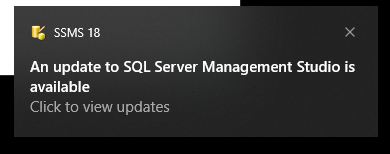
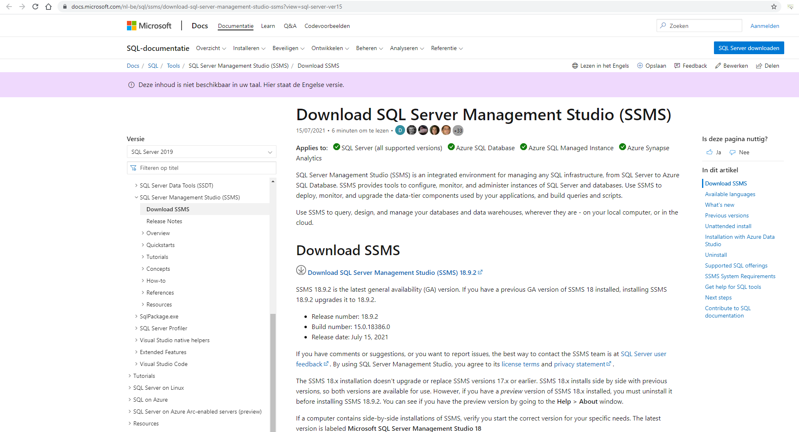

# SSMS

Indien SSMS niet meer up to date is, zal nu het opstarten ervan een popup verschijnen die je toont hoe je de nieuwste versie kan installeren. Als voorbeeld tonen we de relevante informatie van medio augustus 2021:

