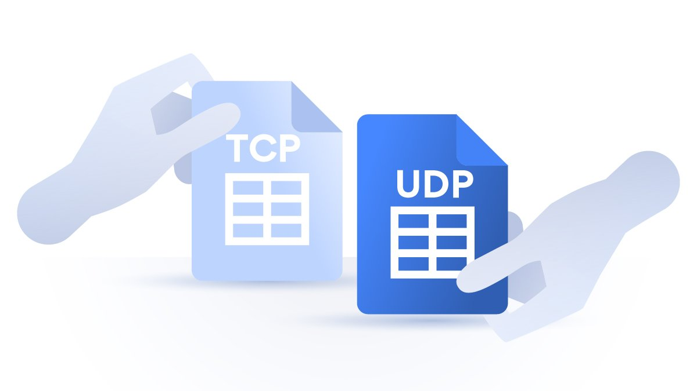
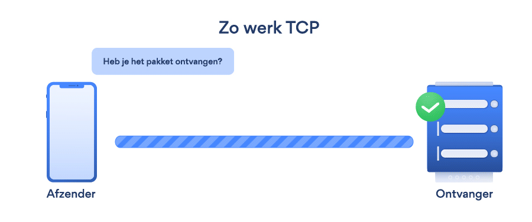
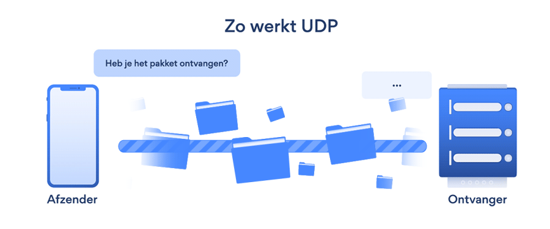
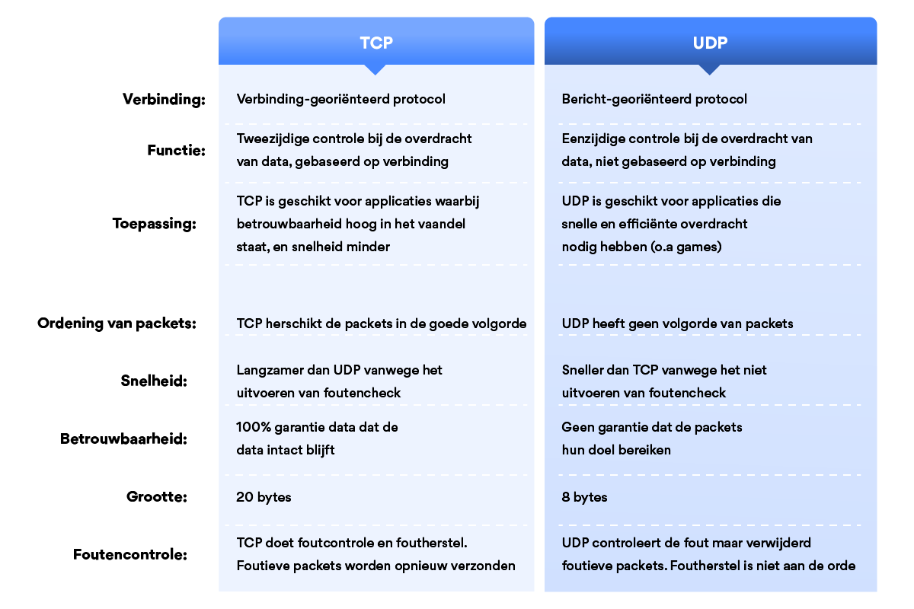

# UDP versus TCP

TCP, UDP, netwerkprotocollen, databits: de kans is groot dat deze termen je niets zeggen als je geen ICT-expert bent. Toch is het handig om te weten wat deze termen betekenen. Wanneer je surft op het internet, je e-mail gebruikt of bestanden verzendt, maak je gebruik van TCP. Beschikbaarheid van servers en streaming zoals een live video bekijken zijn enkele toepassingen van UDP. 

TCP staat voor **Transmission Control Protocol**. Het is een veelgebruikt protocol. Hiermee worden gegevens overgedragen op het internet via netwerkverbindingen, maar ook op computernetwerken. TCP kan gegevens in een datastroom versturen, wat betekent dat deze gegevens gegarandeerd aankomen op hun bestemming. Communicatiefouten worden daarnaast ook opgevangen. TCP wordt niet alleen gebruikt voor verkeer op het internet, maar ook voor het downloaden en streamen van video’s.

Hoe werkt TCP? Wanneer je vanaf jouw computer op een link van een website klikt, stuurt de browser zogenaamde TCP packets naar de server van de betreffende website. De server van de website stuurt ook weer TCP packets terug. De packets krijgen een getal, waardoor de ontvanger deze packets in de juiste volgorde krijgt. Behalve het sturen van de packets controleert TCP deze data ook. De server stuurt dan bericht naar de verzender om de ontvangst van packets te bevestigen. Bij een onjuist antwoord worden de packets opnieuw gestuurd.

UDP staat voor **User Datagram Protocol**. Dit is een bericht-georiënteerd protocol. Dit wil zeggen dat een verzender een bericht stuurt aan de ontvanger, net als bij het TCP protocol. Het verschil met TCP is echter dat de ontvanger bij UDP geen bevestiging stuurt naar de verzender. Dit betekent dat UDP vooral geschikt is voor eenrichtingscommunicatie, waarbij het verlies van enige data geen probleem vormt. Het UDP protocol wordt vooral gebruikt bij live streaming en online gaming.

UDP is sneller dan TCP, omdat het geen controles uitvoert en geen tweerichtingsverkeer is. Dit betekent echter wel dat UDP minder betrouwbaar is dan TCP als het gaat om het versturen van data.

Wanneer gebruik je TCP en wanneer gebruik je UDP? TCP wordt vaak gebruikt wanneer er sprake is van een belangrijke overdracht van informatie. Denk hierbij aan het versturen van een bestand van de ene naar de andere computer. Het gaat hierbij niet om de snelheid, maar om de accuratesse waarmee een bestand wordt verstuurd. UDP wordt vooral gebruik wanneer snelheid boven veiligheid en accuratesse gaat. Een 100% foutloze verbinding is in dit geval niet noodzakelijk. Denk hierbij aan het streamen van een live video of online gaming. Kort gezegd draait het bij TCP om nauwkeurigheid en bij UDP om snelheid. Wil je een beide gevallen verzekerd zijn van een veilige verbinding? Gebruik dan een Virtual Private Network (VPN). Een VPN versleutelt je connectie, terwijl de snelheid op peil blijft.

UDP vs. TCP: wat zijn de belangrijkste verschillen tussen deze twee? In de eerste plaats gaat het om de manier waarop gegevens en data uitgewisseld worden. Toch zijn er nog meer verschillen zichtbaar. Hier vind je een overzicht van deze verschillen in een overzichtelijke tabel:

TCP zorgt gegarandeerd voor een betrouwbare maar ook een geordende levering van gegevens van de gebruiker naar de server en andersom. UDP is niet bedoeld voor end-to-end verbindingen en communicatie en controleert de gereedheid van de ontvanger niet. Verschillen:

### 1: Betrouwbaarheid

Wanneer je verzekerd wil zijn van een betrouwbare overdracht van informatie, kan je het beste TCP gebruiken. Waarom is TCP betrouwbaarder? Hier worden bericht-bevestiging en hertransmissies beheert wanneer er sprake is van verloren onderdelen. Er zullen dus nooit gegevens ontbreken. Bij UDP heb je nooit de zekerheid of de communicatie de ontvanger heeft bereikt. Concepten van bevestiging, hertransmissie en time-out zijn niet aanwezig.

### 2: Ordening van pakketten

Bij TCP overdrachten is er altijd sprake van een bepaalde volgorde. De data wordt in een bepaalde reeks naar de server verzonden, en kom in dezelfde volgorde terug. Komen bepaalde gegevens in de verkeerde volgorde aan? Dan herstelt TCP dat en verstuurt de data opnieuw. Bij UDP is er geen sprake van een volgorde. Van te voren kun je dan ook niet voorspellen in welke volgorde de gegevens worden ontvangen.

### 3: Verbinding

Bij TCP is een zwaargewicht verbinding die drie pakketten vereist voor een zogenaamde socket-verbinding. Een socket-verbinding wordt toegepast wanneer een verbinding met een andere host tot stand wordt gebracht. Een socket bestaat altijd uit een IP-adres. Deze verbinding zorgt bij TCP voor betrouwbaarheid. UDP is een lichtgewicht transportlaag, gecreëerd op een IP. Volgverbindingen of het ordenen van gegevens is dan ook niet mogelijk.

### 4: Foutencontrole

TCP gebruikt niet alleen foutencontrole, maar ook foutenherstel. Fouten worden gedetecteerd door middel van een controle. Is een pakket foutief? Dan wordt het niet door de ontvanger bevestigd. Daarna is er sprake van een hertransmissie door de verzender. Dit mechanisme wordt ook wel **Positive Acknowledgement with Retransmission** (PAR) genoemd.

UDP werkt op basis van best-effort. Dit betekent dat het protocol foutdetectie wel ondersteunt, maar er niets mee doet. Een fout kan worden gedetecteerd, maar daarna wordt het pakket genegeerd. Er wordt niet geprobeerd om het pakket opnieuw te verzenden om de fout te herstellen zoals dat bij TCP wel het geval is. Dit komt omdat UDP vooral wordt gebruikt voor de snelheid.

